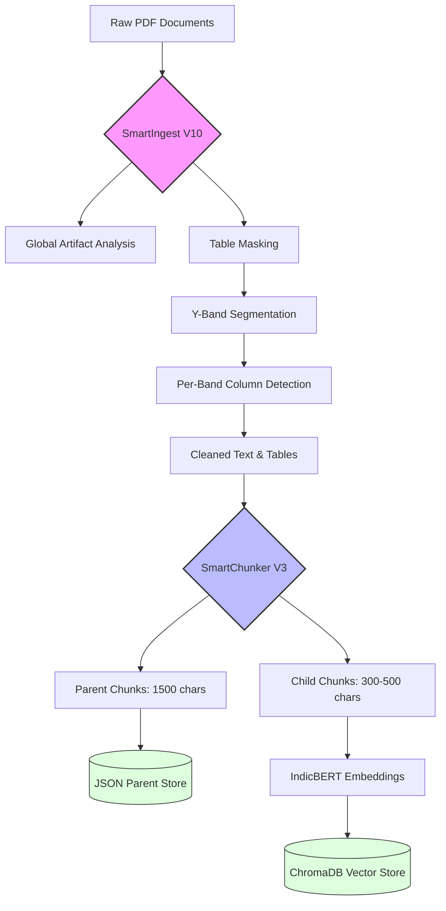
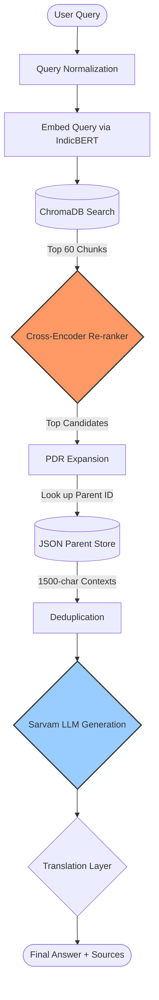
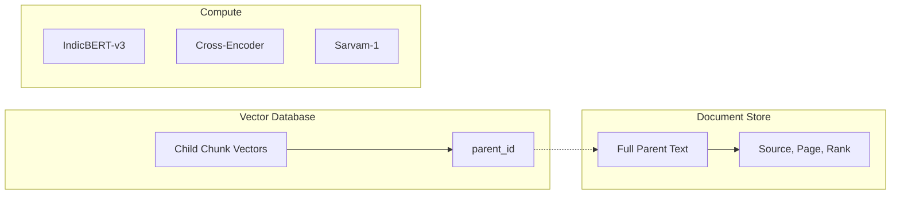
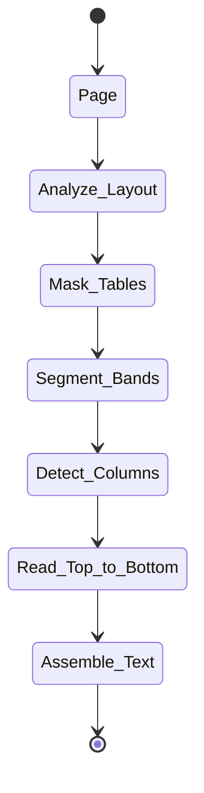

# MKRS BRAIN V1.0 — ARCHITECTURE & FLOWCHARTS

This document visualizes the data flow and system architecture of the MBS V1.0 RAG system.

---

## 1. The Ingestion Pipeline (PDF to Knowledge Base)
This flowchart shows how raw PDFs are processed into a searchable format.

---

## 2. The Retrieval Pipeline (Query to Answer)
This flowchart shows how the system "thinks" when a user asks a question.

---

## 3. High-Level Component Relationship
How the storage systems interact.

---

## 4. Logical State Diagram (Single Extraction)
A deep look at how a single page is "decomposed."

