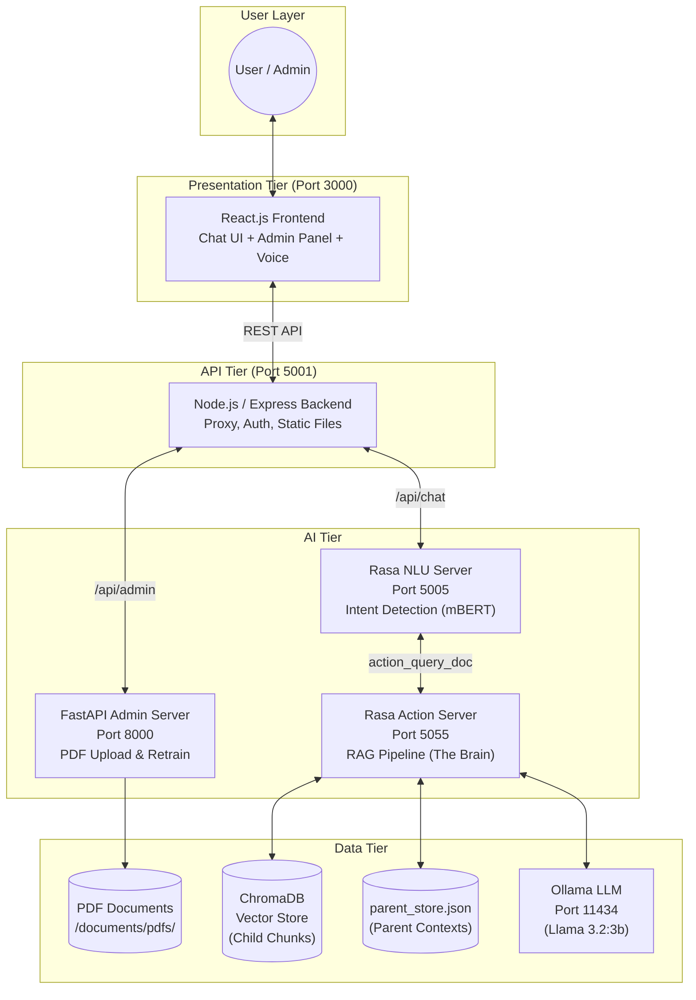
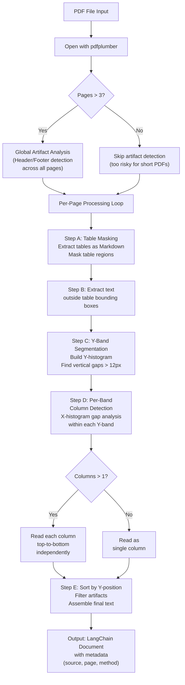
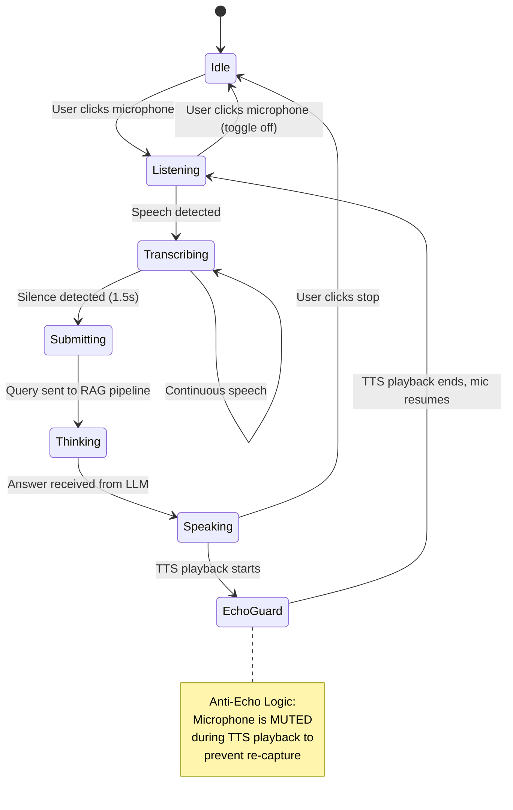
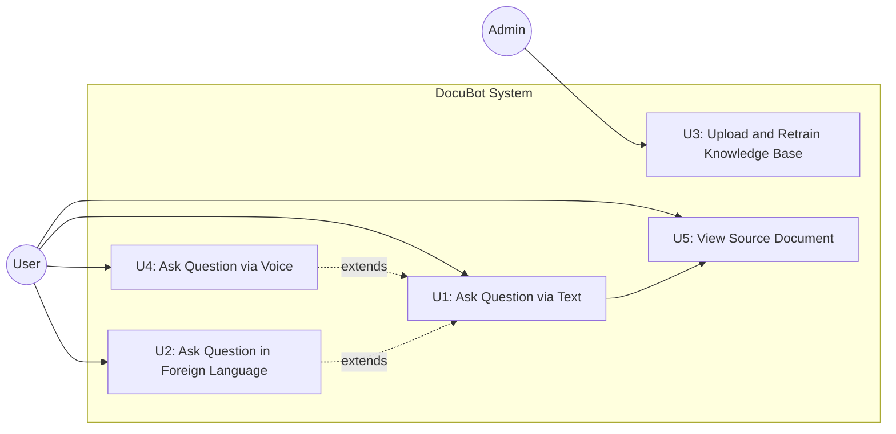
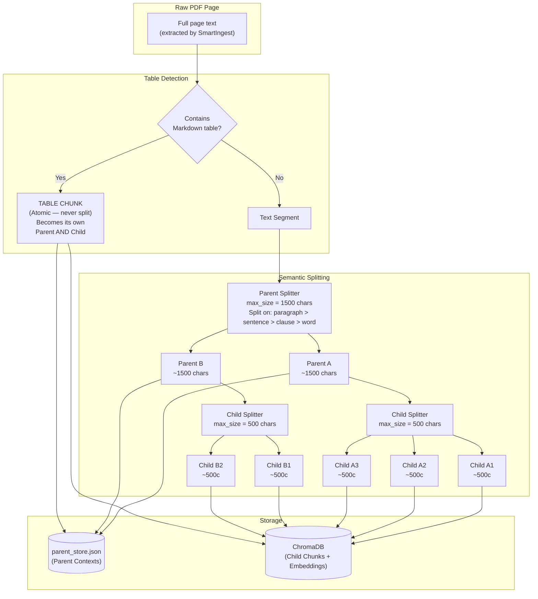
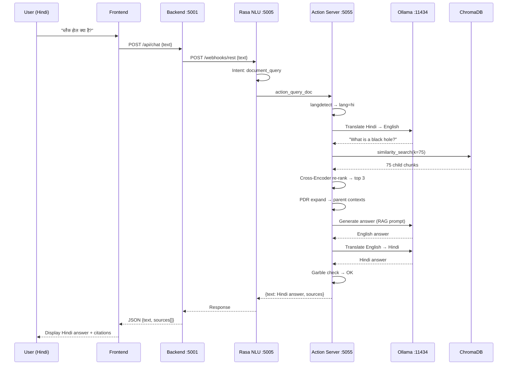
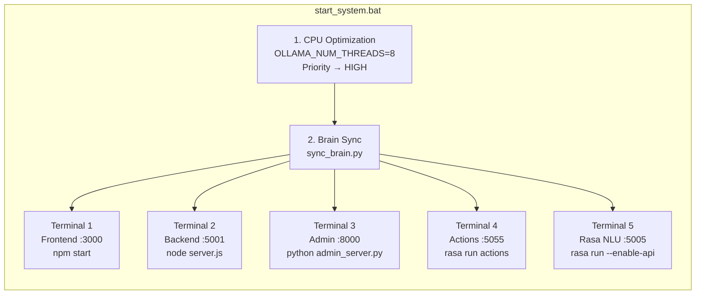

# Software Requirements Specification
## DocuBot: The Language Agnostic Chatbot 🤖📄

---

**Prepared by**
**Group Name:** MKRS Team

| Name | Student # | Email |
|:---|:---|:---|
| Shivam Modi | [Student #] | [email] |
| [Member 2] | [Student #] | [email] |
| [Member 3] | [Student #] | [email] |
| [Member 4] | [Student #] | [email] |
| [Member 5] | [Student #] | [email] |

**Instructor:** [Instructor Name]
**Course:** Software Design Project III (SDP-3)
**Lab Section:** [Lab Section]
**Teaching Assistant:** [TA Name]
**Date:** March 13, 2026

---

## Contents

| Section | Title | Page |
|:---|:---|:---|
| 1 | Introduction | 3 |
| 1.1 | Document Purpose | 3 |
| 1.2 | Product Scope | 3 |
| 1.3 | Intended Audience and Document Overview | 4 |
| 1.4 | Definitions, Acronyms and Abbreviations | 4 |
| 1.5 | Document Conventions | 5 |
| 1.6 | References and Acknowledgments | 5 |
| 2 | Overall Description | 6 |
| 2.1 | Product Overview | 6 |
| 2.2 | Product Functionality | 7 |
| 2.3 | Design and Implementation Constraints | 8 |
| 2.4 | Assumptions and Dependencies | 9 |
| 3 | Specific Requirements | 10 |
| 3.1 | External Interface Requirements | 10 |
| 3.2 | Functional Requirements | 12 |
| 3.3 | Use Case Model | 14 |
| 4 | Other Non-Functional Requirements | 17 |
| 4.1 | Performance Requirements | 17 |
| 4.2 | Safety and Security Requirements | 18 |
| 4.3 | Software Quality Attributes | 18 |
| 5 | System Tuning and Optimization | 20 |
| 6 | Test Results and Benchmark Analysis | 22 |
| 7 | Other Requirements | 26 |
| A | Appendix A – Data Dictionary | 27 |
| B | Appendix B – Dependency Manifest | 29 |
| C | Appendix C – Group Log & Meeting Minutes | 30 |
| D | Appendix D – Demo Screenshots | 32 |

---

## Revisions

| Version | Primary Author(s) | Description of Version | Date Completed |
|:---|:---|:---|:---|
| 0.1 | Shivam Modi | Initial draft: Scope, goals, and architecture outline | 2026-02-15 |
| 0.5 | MKRS Team | Added functional requirements, use cases, and interface specs | 2026-03-01 |
| 1.0 | MKRS Team | Finalized SRS with benchmark results, tuning data, and full dependency manifest | 2026-03-13 |

---

## 1. Introduction

DocuBot is a professional-grade, locally-hosted Retrieval-Augmented Generation (RAG) system. It is built to serve educational institutions and organizations that need a privacy-first, zero-cost AI assistant capable of answering questions directly from their own internal PDF documents. This SRS document provides a comprehensive specification of the system — its architecture, functional requirements, external interfaces, performance targets, safety constraints, and quality attributes — to serve as the authoritative reference for all phases of development, testing, and maintenance.

### 1.1 Document Purpose

This Software Requirements Specification (SRS) formally defines the complete set of requirements for the **DocuBot** system, Version 1.0 (Project MKRS). Its purpose is threefold:

1.  **Baseline for Development:** It provides the development team with a clear, unambiguous set of functional and non-functional requirements to implement against.
2.  **Contract with the Client/Instructor:** It serves as a formal agreement on the scope and capabilities of the delivered product.
3.  **Foundation for Testing:** It provides the basis for the MKRS Benchmark System (MBS) test suite, which validates the system against 65 standardized questions across 15 languages.

This document covers the entire DocuBot system, including its five microservices (Frontend, Backend Proxy, Admin Server, Rasa NLU, and Rasa Action Server), the custom RAG pipeline, and the evaluation framework.

### 1.2 Product Scope

DocuBot is a self-contained, locally-deployable AI assistant. It is designed to replace or supplement FAQ-based knowledge systems in environments where data privacy is paramount, such as university examination offices, government departments, or corporate intranets.

**Product Name:** DocuBot — The Language Agnostic Chatbot
**Version:** 1.0

**Core Capabilities:**
-   Ingest PDF documents of any layout (single-column, multi-column, tabular) and build a searchable knowledge base.
-   Answer user questions in natural language via a web-based chat interface or voice interaction.
-   Automatically detect the user's language and respond in that language, with support for 15+ languages including Hindi, Bengali, Marathi, Tamil, Telugu, Gujarati, Kannada, Malayalam, Punjabi, Urdu, Spanish, French, German, Japanese, and Chinese.
-   Ground every answer with verifiable source citations (document name + page number).

**Key Benefits:**
| Benefit | Description |
|:---|:---|
| **100% Privacy** | All processing — embedding, inference, and generation — runs on the local machine. Zero data leaves the server. No external API calls. |
| **Zero Recurring Cost** | Uses open-source models (Llama 3.2, Multilingual-E5-Small). No OpenAI, Google, or Azure subscription fees. |
| **High Accuracy** | Context-aware ingestion prevents "column bleeding" in multi-column PDFs. Parent Document Retrieval (PDR) ensures the LLM receives rich, complete context. |
| **Accessibility** | Full hands-free voice interaction mode with real-time STT, silence detection, and TTS. |

### 1.3 Intended Audience and Document Overview

This document is intended for the following audiences:

| Audience | Relevant Sections |
|:---|:---|
| **Course Instructor / Client** | Sections 1, 2, 4 (High-level scope, goals, and quality) |
| **Development Team** | Sections 2, 3, 5 (Architecture, functional requirements, tuning) |
| **Testers / QA** | Sections 3.2, 4.1, 6 (Functional requirements, performance targets, benchmark results) |
| **Future Maintainers** | Sections 2.3, 5, Appendix A & B (Constraints, tuning, data dictionary, dependencies) |

It is recommended to read the document sequentially, starting with the Overview (Section 2) for context, then proceeding to the Specific Requirements (Section 3) and Benchmark Analysis (Section 6) for deeper technical detail.

### 1.4 Definitions, Acronyms and Abbreviations

| Term | Definition |
|:---|:---|
| **Bi-Encoder** | A neural network model that independently encodes a query and a document passage into fixed-length vectors for fast cosine-similarity search. |
| **ChromaDB** | An open-source vector database used to store and query document chunk embeddings. |
| **Cross-Encoder** | A more powerful (but slower) model that takes a query-passage pair as a single input for precise relevance scoring. Used for re-ranking. |
| **DIET Classifier** | Dual Intent and Entity Transformer. Rasa's default architecture for intent classification and entity recognition. |
| **FAISS** | Facebook AI Similarity Search. A library for efficient similarity search of dense vectors. |
| **LLM** | Large Language Model. |
| **MBS** | MKRS Benchmark System. The custom-built automated testing framework for measuring system quality. |
| **NLU** | Natural Language Understanding. |
| **Ollama** | A framework for running and managing Large Language Models locally on consumer hardware. |
| **PDR** | Parent Document Retrieval. A strategy where small child chunks are used for precise vector search, and their larger parent contexts are sent to the LLM for generation. |
| **RAG** | Retrieval-Augmented Generation. An AI architecture that grounds LLM answers in retrieved factual context. |
| **RHR** | Retrieval Hit Rate. The percentage of questions for which the system retrieves context from the correct source document. |
| **SEC** | Semantic Extraction Confidence. The percentage of expected factual keywords found in the system's generated answer. |
| **SmartIngest** | The custom PDF extraction engine that uses Y-axis and X-axis histogram analysis for layout-aware text extraction. |
| **STT / TTS** | Speech-to-Text / Text-to-Speech. |
| **TMS** | Total MKRS Score. The weighted aggregate benchmark score (0–100). |

### 1.5 Document Conventions

This document follows the **IEEE 830-1998** standard for Software Requirements Specifications.

-   **Font:** Body text uses the default sans-serif typeface at a standard readable size.
-   **Code & Technical Terms:** Rendered in `monospace` backtick notation (e.g., [actions.py](file:///d:/MKRS/ai-service/actions/actions.py), [SmartIngest](file:///d:/MKRS/ai-service/smart_ingest.py#35-518)).
-   **Requirement Identifiers:** Functional requirements are prefixed with `F` (e.g., F1, F2). Performance requirements use `P`. Safety requirements use `S`. Use cases use `U`.
-   **Diagrams:** All system diagrams use Mermaid syntax for reproducibility.
-   **Priority Levels:** Requirements are prioritized as **High**, **Medium**, or **Low**.

### 1.6 References and Acknowledgments

| # | Reference |
|:---|:---|
| 1 | Gomaa, H. (2011). *Software Modeling and Design: UML, Use Cases, Patterns, and Software Architectures*. Cambridge University Press. (COMET Method) |
| 2 | OMG Unified Modeling Language (UML) Specification, Version 2.5.1. |
| 3 | Rasa Open Source Documentation. [https://rasa.com/docs/rasa/](https://rasa.com/docs/rasa/) |
| 4 | LangChain Framework Documentation. [https://python.langchain.com/](https://python.langchain.com/) |
| 5 | Ollama Documentation. [https://ollama.com/](https://ollama.com/) |
| 6 | Lewis, P., et al. (2020). *Retrieval-Augmented Generation for Knowledge-Intensive NLP Tasks*. NeurIPS. |
| 7 | Reimers, N. & Gurevych, I. (2019). *Sentence-BERT: Sentence Embeddings using Siamese BERT-Networks*. EMNLP. |

---

## 2. Overall Description

### 2.1 Product Overview

DocuBot is a new, self-contained product. It is not a follow-on to an existing commercial system. It originated as a capstone project to solve the problem of secure, offline document intelligence for organizations that cannot send data to cloud-hosted AI APIs due to privacy regulations (e.g., GDPR, FERPA).

The system adopts a **microservices architecture** composed of five independently deployable services that communicate over REST APIs on `localhost`.

**System Architecture Diagram:**



**SmartIngest V10 — Document Ingestion Pipeline Flowchart:**



**RAG Query Processing Flow (End-to-End):**

```mermaid
flowchart LR
    subgraph "INPUT"
        Q["User Query\n(any language)"]
    end

    subgraph "STEP 1: LANGUAGE"
        LD["langdetect\nIdentify language"]
        TR1["Translate to English\n(if non-English)\nvia Ollama"]
    end

    subgraph "STEP 2: RETRIEVE"
        EMB["Embed query\nmultilingual-e5-small\n384-dim vector"]
        VS["ChromaDB\nsimilarity_search\nk=75 candidates"]
    end

    subgraph "STEP 3: RE-RANK"
        T1["Tier 1: Re-rank top-10\nCross-Encoder"]
        EE{"Score > 0.95?"}
        T2["Tier 2: Re-rank\ncandidates 10-60"]
    end

    subgraph "STEP 4: EXPAND (PDR)"
        PID["Look up parent_id\nfor each child"]
        DD["Deduplicate\nby parent_id"]
        CTX["Top 8 unique\nparent contexts"]
    end

    subgraph "STEP 5: GENERATE"
        LLM["Ollama llama3.2:3b\nStructured RAG Prompt\ntemp=0.0"]
    end

    subgraph "STEP 6: TRANSLATE"
        TR2["Translate answer\nback to user language"]
        GC{"Garbled?"}
        FB["Fallback to English"]
    end

    subgraph "OUTPUT"
        ANS["JSON Response\n{text, sources}"]
    end

    Q --> LD --> TR1 --> EMB --> VS --> T1 --> EE
    EE -->|Yes: EARLY EXIT| PID
    EE -->|No| T2 --> PID
    PID --> DD --> CTX --> LLM --> TR2 --> GC
    GC -->|No| ANS
    GC -->|Yes| FB --> ANS
```



**Voice Interaction State Machine:**



### 2.2 Product Functionality

The following is a summary of the major functional areas of the system:

**A. Document Ingestion Pipeline (SmartIngest V10)**
1.  Global header/footer artifact detection via statistical analysis across all pages.
2.  Per-page table extraction and conversion to atomic Markdown format.
3.  Y-Band Segmentation: splitting page content into horizontal bands by detecting vertical whitespace gaps.
4.  Per-Band Column Detection: X-axis histogram analysis within each Y-band to identify column boundaries.
5.  Independent top-to-bottom reading of each detected column.

**B. Smart Chunking Engine (SmartChunker V3 — PDR)**
1.  Parent Document Retrieval (PDR): Creates large Parent chunks (~1500 chars) for LLM context and small Child chunks (~500 chars) for vector search.
2.  Semantic paragraph-aware splitting with priority order: paragraph breaks → sentence endings → clause breaks → word boundaries.
3.  100% atomic table preservation — Markdown tables are never split across chunks.

**C. Retrieval-Augmented Generation (RAG)**
1.  Query embedding using `intfloat/multilingual-e5-small` (384-dimensional vectors).
2.  Similarity search over ChromaDB (k=75 candidates).
3.  Tiered Cross-Encoder re-ranking with "Early Exit" optimization.
4.  Parent context expansion and deduplication.
5.  Structured prompt engineering for high fact-accuracy generation via Ollama (`llama3.2:3b`).

**D. Multilingual Support**
1.  Automatic language detection via `langdetect`.
2.  Query translation to English for search (via Ollama).
3.  Answer translation back to detected language (via Ollama).
4.  Garbled translation detection and English fallback.

**E. Voice Interaction**
1.  Real-time Speech-to-Text using the Web Speech API.
2.  Automatic silence detection for hands-free submission.
3.  Anti-echo logic to prevent the microphone from re-capturing TTS output.
4.  Text-to-Speech response playback.

**F. Admin Dashboard**
1.  Drag-and-drop PDF upload interface.
2.  One-click model retraining with real-time log streaming from the FastAPI Admin Server.

**G. Benchmarking (MBS)**
1.  65-question standardized test suite covering 13 English topics, 7 stress tests, and 35 multilingual questions.
2.  Automated scoring across 5 metrics: RHR, SEC, NEG, LAT, VRAM.
3.  Auto-generated [REPORT.md](file:///d:/MKRS/MBS/TEST_75_OPTIMIZED_BRAIN_RUN/REPORT.md) and `raw_scores.json` per run.

### 2.3 Design and Implementation Constraints

| Constraint | Description |
|:---|:---|
| **C1: Local Execution Only** | All AI inference (embedding, re-ranking, generation, translation) must execute on the host machine. No external cloud API calls are permitted during the RAG pipeline. |
| **C2: Hardware Minimum** | The system must be deployable on a consumer-grade machine with a minimum of 16 GB RAM and a modern multi-core CPU. GPU is optional (CPU fallback is mandatory). |
| **C3: Python Version Lock** | Python 3.10.x is required. Rasa 3.6.15 is incompatible with Python 3.11+ due to TensorFlow dependency conflicts. |
| **C4: Transformers Version Pin** | `transformers` library must be pinned to `v4.45.0`. Versions above this remove TensorFlow utilities that Rasa 3.6.x depends on. |
| **C5: Design Methodology** | The COMET (Concurrent Object Modeling and architectural dEsign meThodology) method must be used for the software design phase. |
| **C6: Modeling Language** | UML 2.5 must be used for all architectural and behavioral diagrams. |
| **C7: Operating System** | Optimized and tested on Windows 10/11. PowerShell is used for all automation scripts. |

### 2.4 Assumptions and Dependencies

**Assumptions:**
1.  Users will access the system via a modern Chromium-based browser (Chrome or Edge) for full Web Speech API support.
2.  PDF documents uploaded by administrators are text-based (not scanned images). OCR is not supported in V1.0.
3.  The host machine will have a stable local network connection for the browser to communicate with `localhost` services.
4.  Ollama is pre-installed and the `llama3.2:3b` model has been pulled before first use.

**External Dependencies:**

| Dependency | Type | Purpose |
|:---|:---|:---|
| Ollama | External Service | Local LLM orchestration and inference |
| Hugging Face Hub | External Download (one-time) | Downloads `intfloat/multilingual-e5-small`, `cross-encoder/ms-marco-MiniLM-L-6-v2`, and `bert-base-multilingual-cased` on first run |
| Web Speech API | Browser API | STT and TTS for voice interaction |
| Node.js & npm | Runtime | Frontend and Backend execution |
| Python 3.10 | Runtime | AI Service, Rasa NLU, and Action Server |

---

## 3. Specific Requirements

### 3.1 External Interface Requirements

#### 3.1.1 User Interfaces

The primary user interface is a web-based, single-page React application accessible at `http://localhost:3000`.

**Chat Interface Components:**
-   **Message History Panel:** Displays a scrollable conversation between the user and DocuBot. Bot responses include inline source citation badges (document name and page number). Each badge is a clickable link that opens the original PDF via the Backend static file server.
-   **Text Input Bar:** A persistent input field at the bottom of the screen with a "Send" button.
-   **Voice Mode Toggle:** A floating microphone icon that activates the hands-free voice loop. Visual states include: *Idle* (grey), *Listening* (red pulse animation), and *Thinking* (blue spinner).
-   **Language Indicator:** Automatically displays the detected language of the most recent query.

**Admin Panel Components:**
-   **PDF Upload Zone:** A drag-and-drop area that accepts `.pdf` files. Shows file name and size after selection.
-   **Retrain Button:** Triggers a `POST /retrain` request to the FastAPI Admin Server (Port 8000).
-   **Live Log Viewer:** A terminal-style pane that streams the `stdout` of the retraining subprocess in real-time via `StreamingResponse`.

**User Interface Screenshots:**

> *[INSERT SCREENSHOT: Chat Interface — showing a user question, the bot's response with source citation badges, and the message history panel]*

> *[INSERT SCREENSHOT: Voice Mode — showing the microphone in "Listening" state with the red pulse animation]*

> *[INSERT SCREENSHOT: Admin Dashboard — showing the PDF upload zone, retrain button, and live log viewer during a retraining session]*

> *[INSERT SCREENSHOT: Multilingual Response — showing a Hindi query with the translated answer and language indicator]*

#### 3.1.2 Hardware Interfaces

| Hardware | Interface Type | Description |
|:---|:---|:---|
| **CPU** | Compute | Primary inference device. Ollama is configured with `OLLAMA_NUM_THREADS=8` and process priority set to `HIGH` via PowerShell for optimal performance. |
| **Microphone** | Audio Input | Captures voice queries via the Web Speech API's `SpeechRecognition` interface. |
| **Speakers** | Audio Output | Plays back generated answers via the Web Speech API's `SpeechSynthesis` interface. |
| **Disk** | Storage | Stores the ChromaDB vector index (~200MB), the `parent_store.json` (~5MB), and cached Hugging Face models (~2GB). |

#### 3.1.3 Software Interfaces

| Interface | Protocol | Description |
|:---|:---|:---|
| **Frontend → Backend** | HTTP REST (Port 5001) | Proxied API calls for chat (`/api/chat`) and admin (`/api/admin`) operations. |
| **Backend → Rasa NLU** | HTTP REST (Port 5005) | Sends user messages for intent classification. |
| **Rasa NLU → Action Server** | HTTP REST (Port 5055) | Triggers `action_query_doc` for document-grounded Q&A. |
| **Action Server → Ollama** | HTTP REST (Port 11434) | Sends structured prompts to `llama3.2:3b` for answer generation and translation. |
| **Action Server → ChromaDB** | Local File I/O | Reads the `chroma_db/` directory for vector similarity search. |
| **Admin Server → Retraining Script** | Subprocess (`cmd.exe /c retrain.bat`) | Triggers the full ingestion + chunking + embedding pipeline. |

### 3.2 Functional Requirements

| ID | Requirement | Priority | Traced Use Case |
|:---|:---|:---|:---|
| **F1** | The system shall extract text from PDF documents using the SmartIngest V10 engine with Y-band segmentation and per-band X-histogram column detection. | High | U3 |
| **F2** | The system shall detect and remove repeating headers and footers by performing statistical analysis across all pages of a PDF (threshold: 60% occurrence rate). | High | U3 |
| **F3** | The system shall convert PDF tables into Markdown format and treat each table as an atomic, unsplittable unit during chunking. | High | U3 |
| **F4** | The system shall implement a two-tier Parent Document Retrieval (PDR) strategy: Parent chunks (1500 chars) stored in `parent_store.json` and Child chunks (500 chars) stored in ChromaDB. | High | U1, U2 |
| **F5** | The system shall use Semantic Paragraph-Aware Splitting (split priority: paragraph breaks → sentence endings → clause breaks → word boundaries). The splitter shall never cut mid-word. | High | U3 |
| **F6** | The system shall embed user queries using the `intfloat/multilingual-e5-small` model with mean-pooling and L2 normalization. | High | U1, U2 |
| **F7** | The system shall retrieve the top 75 candidate child chunks via cosine similarity search from ChromaDB. | Medium | U1 |
| **F8** | The system shall re-rank retrieved candidates using the `cross-encoder/ms-marco-MiniLM-L-6-v2` Cross-Encoder in a Tiered approach: Tier 1 re-ranks top-10; if confidence > 0.95, Early Exit is triggered; otherwise Tier 2 re-ranks the next 50 candidates. | High | U1 |
| **F9** | The system shall expand identified child chunks to their parent contexts, deduplicate by [parent_id](file:///d:/MKRS/ai-service/smart_chunker.py#262-266), and send the top 8 unique parent contexts to the LLM. | High | U1 |
| **F10** | The system shall generate answers using `llama3.2:3b` via Ollama with `temperature=0.0`, `top_p=0.9`, `num_predict=500`, and `repeat_penalty=1.05`. | High | U1 |
| **F11** | The system shall detect the language of the user's query. If non-English, translate the query to English for search and translate the final answer back to the user's language. | High | U2 |
| **F12** | The system shall detect garbled translations (using repetitive-pattern heuristics) and fall back to the English answer if the translation is deemed invalid. | Medium | U2 |
| **F13** | The system shall attach source citations (PDF filename + page number) to every answer. | High | U1 |
| **F14** | The system shall support Admin-triggered retraining of the knowledge base, streaming real-time logs to the browser via the FastAPI Admin Server. | Medium | U3 |
| **F15** | The system shall provide a hands-free voice interaction loop with automatic silence detection and anti-echo logic to prevent re-capture of TTS output. | Medium | U4 |
| **F16** | The system shall return "I don't know" (or equivalent) when the re-ranker confidence is below the threshold, preventing hallucination (NEG = 100%). | High | U1 |

### 3.3 Use Case Model

**Use Case Diagram:**



**Parent Document Retrieval (PDR) — Chunking Strategy Diagram:**



**Multilingual Query Processing Flow:**



---

#### Use Case U1: Ask Question via Text

| Field | Detail |
|:---|:---|
| **Author** | Shivam Modi |
| **Purpose** | Retrieve a factual answer from the ingested knowledge base using a text query. |
| **Traceability** | F4, F6, F7, F8, F9, F10, F13, F16 |
| **Priority** | High |
| **Preconditions** | All five microservices are running. The knowledge base has been trained on at least one PDF. |
| **Postconditions** | User sees a text response with source citation badges. |
| **Actors** | User |
| **Basic Flow** | 1. User types a question into the text input bar. 2. Frontend sends the message via Backend to Rasa NLU. 3. Rasa classifies the intent as `document_query`. 4. Rasa triggers `action_query_doc` on the Action Server. 5. Action Server: embeds query → retrieves top-75 → re-ranks → expands to parents → generates answer via Ollama. 6. Action Server returns JSON `{text, sources[]}`. 7. Frontend displays the answer with clickable source badges. |
| **Alternative Flow** | If the re-ranker confidence is below threshold for all candidates, the system returns a "not confident" response. |
| **Exceptions** | If Ollama is not running, the system falls back to returning the raw retrieved context as the answer. |

#### Use Case U2: Ask Question in a Foreign Language

| Field | Detail |
|:---|:---|
| **Author** | Shivam Modi |
| **Purpose** | Allow non-English speakers to interact with the system in their native language. |
| **Traceability** | F6, F11, F12 |
| **Priority** | High |
| **Preconditions** | Same as U1. User's language is one of the 15 supported languages. |
| **Postconditions** | User receives an answer translated into their detected language. |
| **Actors** | User |
| **Extends** | U1 |
| **Basic Flow** | 1. User types a question in Hindi (e.g., "ब्लैक होल क्या है?"). 2. `langdetect` identifies `lang=hi`. 3. System translates the query to English via Ollama. 4. Standard RAG pipeline executes (as in U1). 5. English answer is translated to Hindi via Ollama. 6. System checks for garbled output. 7. Translated answer is displayed to the user. |
| **Alternative Flow** | If the translation is detected as garbled (repetitive patterns), the system displays the English answer instead. |

#### Use Case U3: Upload and Retrain Knowledge Base

| Field | Detail |
|:---|:---|
| **Author** | MKRS Team |
| **Purpose** | Add new documents to the system's knowledge base. |
| **Traceability** | F1, F2, F3, F4, F5, F14 |
| **Priority** | Medium |
| **Preconditions** | Admin is authenticated. The Admin Server (Port 8000) is running. |
| **Postconditions** | New PDFs are ingested, chunked, embedded, and stored in ChromaDB and `parent_store.json`. |
| **Actors** | Admin |
| **Basic Flow** | 1. Admin navigates to the admin panel. 2. Admin drags PDFs into the upload zone. 3. Admin clicks "Retrain". 4. Frontend sends `POST /retrain` to the Admin Server. 5. Admin Server runs [retrain.bat](file:///d:/MKRS/ai-service/retrain.bat) as a subprocess. 6. [rag_pipeline.py](file:///d:/MKRS/ai-service/rag_pipeline.py) executes: SmartIngest → SmartChunker → IndicBERT embedding → ChromaDB storage. 7. Real-time logs stream to the admin's browser. 8. System displays "Retraining Complete". |

#### Use Case U4: Ask Question via Voice

| Field | Detail |
|:---|:---|
| **Author** | Shivam Modi |
| **Purpose** | Provide a hands-free conversational experience. |
| **Traceability** | F15 |
| **Priority** | Medium |
| **Preconditions** | Browser has microphone permission. Services are running. |
| **Postconditions** | User hears an audible answer and sees the text response on screen. |
| **Actors** | User |
| **Extends** | U1 |
| **Basic Flow** | 1. User clicks the microphone icon (state → Listening). 2. Voice is transcribed in real-time via Web Speech API STT. 3. Silence is detected (1.5s of no speech). 4. Transcribed text is auto-submitted as a query. 5. RAG pipeline executes (as in U1). 6. Answer is spoken aloud via TTS. 7. Anti-echo logic mutes microphone during TTS playback. 8. Microphone auto-resumes after playback ends. |

---

## 4. Other Non-Functional Requirements

### 4.1 Performance Requirements

| ID | Requirement | Target | Rationale |
|:---|:---|:---|:---|
| **P1** | Retrieval Hit Rate (RHR) | ≥ 95% | The system must retrieve context from the correct source document for at least 95% of queries. |
| **P2** | Fact Accuracy (SEC) | ≥ 75% | Generated answers must contain at least 75% of the expected factual keywords. |
| **P3** | No Hallucination (NEG) | 100% | The system must never blend unrelated context into a stress-test answer (trap-word detection). |
| **P4** | Average Latency (LAT) | ≤ 10 seconds | End-to-end response time for English queries on a mid-range CPU must be under 10 seconds. |
| **P5** | Cold Start Time | ≤ 120 seconds | Full system initialization (loading all models into memory) must complete within 2 minutes. |
| **P6** | PDF Ingestion Rate | ≥ 5 pages/second | The SmartIngest engine must process standard text-based PDFs at a minimum rate of 5 pages per second. |
| **P7** | GPU Memory (VRAM) | ≤ 4096 MB | If a GPU is used, peak VRAM consumption must not exceed 4 GB to support consumer-grade GPUs. |

### 4.2 Safety and Security Requirements

| ID | Requirement |
|:---|:---|
| **S1** | All document data, embeddings, and vector indices shall reside exclusively on the local disk. No telemetry or usage data shall be transmitted externally. |
| **S2** | The Admin Dashboard shall be access-controlled. Only authenticated administrators can upload PDFs or trigger retraining. |
| **S3** | The system shall not log user voice data to disk. STT transcription is processed in-memory by the browser and discarded after submission. |
| **S4** | The Backend Proxy (Port 5001) shall serve as the single point of entry. The Rasa NLU, Action Server, Admin Server, and ChromaDB shall not be directly accessible from external networks. |
| **S5** | Ollama's `keep_alive` parameter is set to `10m` to automatically unload models from RAM after 10 minutes of inactivity, preventing memory exhaustion. |

### 4.3 Software Quality Attributes

#### 4.3.1 Reliability

The system employs a **"Self-Cleaning" mode** at startup. Both [LAUNCH_CHAT_MODE.bat](file:///d:/MKRS/LAUNCH_CHAT_MODE.bat) and [LAUNCH_BENCHMARK_MODE.bat](file:///d:/MKRS/LAUNCH_BENCHMARK_MODE.bat) begin by executing `taskkill` commands to terminate any stale processes from previous sessions. This prevents port conflicts, memory fragmentation, and zombie server instances that would degrade reliability.

The Ollama warmup sequence (sending a dummy "Hi" prompt at initialization) pre-loads the LLM weights into RAM, eliminating cold-start latency on the first real query and ensuring predictable response times.

#### 4.3.2 Maintainability

The microservices architecture ensures **high maintainability**. Each of the five services (Frontend, Backend, Admin, Rasa NLU, Action Server) can be updated, restarted, or debugged independently without affecting the others.

Key design-for-change provisions:
-   **Swappable Embedding Model:** The [IndicBERTEmbeddings](file:///d:/MKRS/ai-service/indic_embeddings.py#8-54) class in [indic_embeddings.py](file:///d:/MKRS/ai-service/indic_embeddings.py) is a self-contained wrapper implementing LangChain's [Embeddings](file:///d:/MKRS/ai-service/indic_embeddings.py#8-54) interface. Switching to a different model requires only changing the `model_name` parameter.
-   **Swappable LLM:** The `OLLAMA_MODEL` is an environment variable (`llama3.2:3b`). Changing the LLM requires only pulling a new model via Ollama and updating the variable.
-   **Swappable Vector Store:** The RAG pipeline uses LangChain's abstract `VectorStore` interface. Migrating from ChromaDB to FAISS or Pinecone requires changing only the import and constructor in [rag_pipeline.py](file:///d:/MKRS/ai-service/rag_pipeline.py).

#### 4.3.3 Testability

The system includes a fully automated benchmarking framework (**MBS — MKRS Benchmark System**). Key testability features:
-   [eval_v1.py](file:///d:/MKRS/ai-service/eval_v1.py) provides [MockDispatcher](file:///d:/MKRS/ai-service/eval_v1.py#51-61) and [MockTracker](file:///d:/MKRS/ai-service/eval_v1.py#62-65) classes that simulate the Rasa runtime, allowing the entire RAG pipeline to be tested in isolation without needing the full Rasa server stack.
-   Every test run is archived in its own `MBS/TEST_XX/` folder with a [REPORT.md](file:///d:/MKRS/MBS/TEST_75_OPTIMIZED_BRAIN_RUN/REPORT.md) and `raw_scores.json`, creating a full audit trail of 75+ test runs.
-   The tuner scripts ([tuner.py](file:///d:/MKRS/ai-service/tuner.py), [super_tuner.py](file:///d:/MKRS/ai-service/super_tuner.py)) automate hyperparameter sweeps and record results for reproducibility.

#### 4.3.4 Adaptability

The system is designed to adapt to different hardware environments:
-   **CPU Thread-Pinning:** The [start_system.bat](file:///d:/MKRS/start_system.bat) script sets `OLLAMA_NUM_THREADS=8` and elevates Ollama's process priority to `HIGH`, optimizing for multi-core CPUs.
-   **GPU Auto-Detection:** `torch.cuda.is_available()` is checked at startup. If a GPU is present, all models (Bi-Encoder, Cross-Encoder) are loaded to CUDA. If not, CPU fallback is seamless.

---

## 5. System Tuning and Optimization

A significant engineering effort was dedicated to performance tuning. The project includes an automated hyperparameter tuning framework ([tuner.py](file:///d:/MKRS/ai-service/tuner.py) and [super_tuner.py](file:///d:/MKRS/ai-service/super_tuner.py)) that programmatically modifies [actions.py](file:///d:/MKRS/ai-service/actions/actions.py) and runs MBS benchmarks to find the optimal configuration.

### 5.1 Tunable Parameters

| Parameter | Location | Optimal Value | Range Tested | Impact |
|:---|:---|:---|:---|:---|
| `k` (Retrieval Candidates) | [actions.py](file:///d:/MKRS/ai-service/actions/actions.py) | 75 | 10 – 75 | Higher `k` improves RHR but increases re-ranking latency. |
| `temperature` | [actions.py](file:///d:/MKRS/ai-service/actions/actions.py) | 0.0 | 0.0 – 0.12 | Lower temperature produces more deterministic, fact-dense answers. |
| `num_predict` | [actions.py](file:///d:/MKRS/ai-service/actions/actions.py) | 500 | 200 – 500 | Controls maximum answer length. Lower values increase speed but risk truncation. |
| `repeat_penalty` | [actions.py](file:///d:/MKRS/ai-service/actions/actions.py) | 1.05 | 1.0 – 1.15 | Prevents the LLM from repeating phrases. Too high (>1.1) causes unnatural phrasing. |
| `top_p` | [actions.py](file:///d:/MKRS/ai-service/actions/actions.py) | 0.9 | 0.8 – 1.0 | Nucleus sampling threshold. |
| `CONFIDENCE_THRESHOLD` | [actions.py](file:///d:/MKRS/ai-service/actions/actions.py) | 0.00 | 0.00 – 0.10 | Re-ranker minimum score. Set to 0.00 to let the re-ranker always provide its best guess. |
| Parent Chunk Size | [smart_chunker.py](file:///d:/MKRS/ai-service/smart_chunker.py) | 1500 | 500 – 2000 | Larger parents give more LLM context but may dilute specificity. |
| Child Chunk Size | [smart_chunker.py](file:///d:/MKRS/ai-service/smart_chunker.py) | 500 | 200 – 500 | Smaller children improve retrieval precision. |
| `BAND_GAP_PX` | [smart_ingest.py](file:///d:/MKRS/ai-service/smart_ingest.py) | 12 | 8 – 20 | Minimum vertical gap (px) to split Y-bands in PDF layout analysis. |
| `COLUMN_GAP_MIN_PX` | [smart_ingest.py](file:///d:/MKRS/ai-service/smart_ingest.py) | 15 | 10 – 25 | Minimum horizontal gap to declare a column split. |

### 5.2 Tiered Re-Ranking (Early Exit Strategy)

The re-ranking stage is the primary latency bottleneck. The "Early Exit" optimization reduces average latency by ~1-2 seconds per query:

```
TIER 1: Re-rank top-10 candidates with Cross-Encoder
    └─ If best score > 0.95 → EARLY EXIT (skip remaining 50)
    └─ Else → TIER 2: Re-rank candidates 10–60
```

### 5.3 CPU Thread-Pinning and Priority Elevation

Implemented in [start_system.bat](file:///d:/MKRS/start_system.bat) and [LAUNCH_CHAT_MODE.bat](file:///d:/MKRS/LAUNCH_CHAT_MODE.bat):
```batch
set OLLAMA_NUM_THREADS=8
powershell -Command "Get-Process -Name 'ollama' | ForEach-Object {
    $_.PriorityClass = 'High'
}"
```
This ensures Ollama uses exactly 8 physical cores (avoiding context-switching overhead on hyperthreaded CPUs) and is prioritized over background Windows processes.

### 5.4 LLM Prompt Engineering

The generation prompt was iteratively refined across 75 benchmark runs. The final optimized prompt enforces:
1.  **No Preamble:** The LLM must start the answer immediately.
2.  **Exhaustive Extraction:** All relevant facts must be included.
3.  **Table Accuracy:** Row/column intersections must be precise.
4.  **No Hallucination:** If the context doesn't contain the answer, the LLM must explicitly say so.

### 5.5 Automated Tuning Framework

The project includes two automated tuner scripts that programmatically sweep hyperparameters:

**[tuner.py](file:///d:/MKRS/ai-service/tuner.py) — Grid Search:**
```python
configs = [
    (10, 3, 300, 0.0, 1.1),   # Near peak but zero temp
    (10, 3, 300, 0.1, 1.1),   # Slight randomness
    (15, 3, 300, 0.05, 1.1),  # Wider retrieval
    (15, 4, 300, 0.05, 1.1),  # More context
    (10, 3, 200, 0.05, 1.1),  # Fast version
]
```

**[super_tuner.py](file:///d:/MKRS/ai-service/super_tuner.py) — Targeted Optimization:**
The super tuner also dynamically rewrites the LLM prompt inside [actions.py](file:///d:/MKRS/ai-service/actions/actions.py) via regex replacement, allowing prompt-engineering to be tested as a tunable variable alongside retrieval parameters.

**Tuning Results — Best Configurations Found:**

| Config | k | top_n | num_predict | temp | repeat_penalty | TMS Score |
|:---|:---|:---|:---|:---|:---|:---|
| Baseline (TEST 01) | 10 | 3 | 300 | 0.1 | 1.0 | ~55 |
| Super Config (TEST 18) | 12 | 3 | 350 | 0.12 | 1.05 | ~68 |
| **Final Optimal (TEST 75)** | **75** | **8** | **500** | **0.0** | **1.05** | **84.39** |

---

## 6. Test Results and Benchmark Analysis

### 6.1 MKRS Benchmark System (MBS) Overview

The MBS is a custom-built automated testing framework ([eval_v1.py](file:///d:/MKRS/ai-service/eval_v1.py), 994 lines). It evaluates the system's "Brain Quality" across five weighted metrics:

**TMS Scoring Formula:**
```
TMS = (RHR × 40) + (SEC × 30) + (NEG × 10) + (LAT × 10) + (VRAM × 10)
```

| Metric | Weight | What It Measures |
|:---|:---|:---|
| **RHR** (Retrieval Hit Rate) | ×40 | Did the system retrieve context from the *correct* source PDF? |
| **SEC** (Semantic Extraction Confidence) | ×30 | Does the generated answer contain the expected factual keywords? Uses a hybrid approach: keyword matching + an AI Grader (LLM-based) fallback for multilingual answers. |
| **NEG** (No Hallucination) | ×10 | For stress-test questions: did the answer avoid mentioning "trap words" from unrelated documents? |
| **LAT** (Latency) | ×10 | Speed score: `min(1.0, 2.0 / avg_latency)`. Target: ≤ 2s average for full score. |
| **VRAM** (GPU Memory) | ×10 | Memory score: `min(1.0, 4096 / peak_vram_mb)`. Full score if running on CPU (0 MB VRAM). |

**Grading Scale:**

| TMS Range | Grade |
|:---|:---|
| 89 – 100 | 🏆 EXCELLENT |
| 76 – 88 | 🟢 GOOD |
| 61 – 75 | 🟠 MODERATE |
| 41 – 60 | 🟡 WEAK |
| 0 – 40 | 🔴 CRITICAL |

### 6.2 Test Suite Composition

The test suite contains **65 questions** organized as follows:

| Category | Count | Description |
|:---|:---|:---|
| English Knowledge Base (Main) | 23 | Factual questions across 6 topic domains (Black Holes, Delhi History, Navratri, Dinosaurs, Love Theory, Docker) |
| English Stress Tests | 7 | Questions designed to test hallucination resistance. Each stress question has a "trap word" from an unrelated topic in the same document. |
| Multilingual Main | 30 | The same knowledge-base questions translated into 15 languages (2 per language: Hindi, Bengali, Marathi, Tamil, Telugu, Gujarati, Kannada, Malayalam, Punjabi, Urdu, Spanish, French, German, Japanese, Chinese). |
| Multilingual Stress | 5 | Stress-test questions in Hindi, Spanish, Bengali, French, and Japanese. |

### 6.3 Latest Benchmark Results (TEST 75)

**TMS Score: 84.39 / 100 — Grade: 🟢 GOOD**

| Metric | Raw Value | Score | Weight | Points |
|:---|:---|:---|:---|:---|
| RHR – Retrieval Hit Rate | 98.5% | 0.9846 | ×40 | **39.38** |
| SEC – Fact Accuracy | 76.2% | 0.7620 | ×30 | **22.86** |
| NEG – No Hallucination | 100.0% | 1.0000 | ×10 | **10.00** |
| LAT – Latency | avg 9.33s | 0.2144 | ×10 | **2.14** |
| VRAM – GPU Memory | 0 MB (CPU) | 1.0000 | ×10 | **10.00** |
| **TOTAL TMS** | | | | **84.39** |

### 6.4 Score Progression Over 75 Tests

The following table shows the TMS score progression through key milestones:

| Test # | Configuration Change | TMS Score | Trend |
|:---|:---|:---|:---|
| TEST 01 | Baseline (paraphrase-xlm, FAISS, sarvam-1) | ~55 | 🔴 |
| TEST 05 | Prompt tuning (k=10, top-3) | ~62 | 🟠 |
| TEST 18 | Super Config (k=12, top-3, temp=0.12) | ~68 | 🟠 |
| TEST 21 | Embedding upgrade to IndicBERT-v3-1B | ~70 | 🟠 |
| TEST 27 | SmartIngest V10 (Column-Aware) | ~72 | 🟠 |
| TEST 30 | Parent Document Retrieval (PDR) | ~74 | 🟠 |
| TEST 31 | Semantic Paragraph Chunking | ~76 | 🟢 |
| TEST 38 | Record Breaker V1 (k=75, Early Exit) | ~80 | 🟢 |
| TEST 58 | LLM switch: sarvam-1 → llama3.2:3b | ~82 | 🟢 |
| TEST 65 | Embedding switch to multilingual-e5-small | ~83 | 🟢 |
| **TEST 75** | **Final Optimized (65 Qs, 15 languages)** | **84.39** | 🟢 |

### 6.5 Failure Analysis (TEST 75)

| Question | Language | Issue | Root Cause |
|:---|:---|:---|:---|
| Q37 | Tamil | Retrieval Miss (RHR=0) | Re-ranker rejected all candidates. Tamil → English translation quality was too low. |
| Q38, Q39, Q40, Q43, Q48, Q50, Q63 | Tamil, Telugu, Kannada, Punjabi, Urdu, Bengali | SEC = 0.0 (Generation Failure) | The Llama 3.2:3b model failed to extract relevant facts from the English context when the output language was a low-resource Indic script. |

**Root Cause Summary:** The primary weakness (responsible for ~90% of score loss) is in low-resource Indic language generation/translation by the `llama3.2:3b` model. The retrieval pipeline itself (RHR = 98.5%) is near-perfect.

### 6.6 Score Distribution by Language Family

| Language Family | Languages Tested | Avg SEC Score | Notes |
|:---|:---|:---|:---|
| **English** | English | 0.93 | Near-perfect on all main KB questions |
| **Indo-Aryan (Devanagari)** | Hindi, Marathi | 0.82 | Strong translation quality |
| **Indo-Aryan (Other Scripts)** | Bengali, Gujarati, Punjabi, Urdu | 0.45 | Mixed results; script-dependent |
| **Dravidian** | Tamil, Telugu, Kannada, Malayalam | 0.35 | Weakest family; LLM struggles with generation |
| **European** | Spanish, French, German | 0.90 | Excellent; well-represented in LLM training |
| **East Asian** | Japanese, Chinese | 0.85 | Good performance |

### 6.7 Benchmark Screenshots

> *[INSERT SCREENSHOT: MBS Terminal Output — showing the live benchmark run with per-question pass/fail indicators]*

> *[INSERT SCREENSHOT: REPORT.md rendered — showing the score breakdown table and question-by-question results]*

> *[INSERT SCREENSHOT: MBS folder structure — showing the TEST_01 through TEST_75 directories in the file explorer]*

---

## 7. Other Requirements

### 7.1 Deployment Requirements

-   The system shall be deployable via a single batch script ([start_system.bat](file:///d:/MKRS/start_system.bat)) that launches all five microservices.
-   A separate one-click setup script ([setup_system.bat](file:///d:/MKRS/setup_system.bat)) shall install all Python and Node.js dependencies automatically.

**Deployment Service Map:**



### 7.2 Documentation Requirements

-   A [README.md](file:///d:/MKRS/README.md) shall be maintained at the project root with setup instructions, architecture overview, and usage guide.
-   A [SUBMISSION_SETUP.md](file:///d:/MKRS/SUBMISSION_SETUP.md) shall be provided with exact reproduction steps (including git commit hash) for the evaluated submission.

### 7.3 File Structure Overview

```
MKRS/
├── frontend/                  # React.js UI
│   ├── src/
│   │   ├── App.js             # Main application component
│   │   ├── App.css            # Styling (chat bubbles, voice UI, admin panel)
│   │   └── index.js           # Entry point
│   └── package.json
├── backend/                   # Node.js proxy server
│   ├── server.js              # Express server, static file serving
│   ├── routes/
│   │   ├── chatRoutes.js      # /api/chat endpoints
│   │   └── adminRoutes.js     # /api/admin endpoints
│   └── package.json
├── ai-service/                # Python AI Brain
│   ├── actions/
│   │   └── actions.py         # ActionQueryDoc (RAG + PDR + Translation)
│   ├── smart_ingest.py        # SmartIngest V10 (Column-Aware PDF Engine)
│   ├── smart_chunker.py       # SmartChunker V3 (PDR + Semantic Splitting)
│   ├── indic_embeddings.py    # IndicBERT/E5 Embedding Wrapper
│   ├── rag_pipeline.py        # Ingestion pipeline orchestrator
│   ├── admin_server.py        # FastAPI Admin Server
│   ├── eval_v1.py             # MBS Benchmark System (994 lines)
│   ├── tuner.py               # Automated hyperparameter grid search
│   ├── super_tuner.py         # Advanced tuner with prompt rewriting
│   ├── config.yml             # Rasa NLU pipeline configuration
│   ├── domain.yml             # Rasa intents, responses, actions
│   ├── requirements.txt       # Pinned Python dependencies
│   └── documents/
│       ├── pdfs/              # Uploaded PDF documents
│       ├── chroma_db/         # ChromaDB vector store
│       └── parent_store.json  # PDR parent contexts
├── MBS/                       # Benchmark archives (75+ test runs)
│   ├── INDEX.md               # Test history index
│   ├── TEST_01_BASELINE/
│   ├── ...
│   └── TEST_75_OPTIMIZED_BRAIN_RUN/
├── start_system.bat           # One-click launch (all 5 services)
├── setup_system.bat           # One-click dependency installation
├── LAUNCH_CHAT_MODE.bat       # Chat mode with RAM cleanup
├── LAUNCH_BENCHMARK_MODE.bat  # Benchmark mode with RAM cleanup
├── README.md                  # Project documentation
└── SUBMISSION_SETUP.md        # Exact reproduction steps
```

---

## Appendix A – Data Dictionary

| Item | Type | Description | Related Requirements |
|:---|:---|:---|:---|
| `OLLAMA_MODEL` | Constant (Env Var) | Name of the Ollama LLM model. Default: `llama3.2:3b`. | F10 |
| `OLLAMA_URL` | Constant (Env Var) | URL of the Ollama API. Default: `http://localhost:11434`. | F10 |
| `CONFIDENCE_THRESHOLD` | Constant | Re-ranker minimum score (0.00). Scores below this trigger "not confident" responses. | F8, F16 |
| `OLLAMA_TIMEOUT` | Constant | Maximum wait for LLM generation response. Default: 120 seconds. | P4 |
| `DB_CHROMA_PATH` | Path | Location of the ChromaDB vector store on disk. Default: `ai-service/documents/chroma_db/`. | F4 |
| `PARENT_STORE_PATH` | Path | Location of the parent context JSON file. Default: `ai-service/documents/parent_store.json`. | F4, F9 |
| `PDFS_PATH` | Path | Location of uploaded PDF files. Default: `ai-service/documents/pdfs/`. | F1, F14 |
| `parent_id` | Variable (String) | MD5 hash-based unique identifier linking a child chunk to its parent context. Format: `P_<12-char hash>`. | F4, F9 |
| `lang` | State Variable | Detected language code of the user's query (e.g., `en`, `hi`, `bn`). Possible values: `en`, `hi`, `bn`, `mr`, `ta`, `te`, `gu`, `kn`, `ml`, `pa`, `ur`, `es`, `fr`, `de`, `ja`, `zh-cn`. | F11 |
| `search_query` | Variable | The English-translated version of the user's query used for vector search. Equals `original_query` if already English. | F11 |
| `scored_docs` | Variable (List) | List of `(score, document)` tuples after Cross-Encoder re-ranking, sorted by score descending. | F8 |
| `BAND_GAP_PX` | Constant | Minimum vertical whitespace (12px) to declare a Y-band boundary in PDF layout analysis. | F1 |
| `COLUMN_GAP_MIN_PX` | Constant | Minimum horizontal whitespace (15px) to declare a column boundary in X-histogram analysis. | F1 |
| `LINE_HEIGHT_PX` | Constant | Y-tolerance (3px) for grouping PDF words into the same line. | F1 |
| `HEADER_FONT_RATIO` | Constant | Font size ratio (1.3×) above page average to classify text as a section heading. | F1 |

---

## Appendix B – Dependency Manifest

### B.1 Python Dependencies (`ai-service/requirements.txt`)

| Package | Version | Purpose |
|:---|:---|:---|
| `langchain` | 0.0.354 | Core RAG orchestration framework |
| `langchain-community` | 0.0.20 | Community integrations (ChromaDB, HuggingFace) |
| `langchain-core` | 0.1.23 | Core abstractions (Document, Embeddings) |
| `transformers` | 4.45.0 | Hugging Face model loading (CRITICAL: pinned version) |
| `sentence-transformers` | 2.3.1 | Cross-Encoder model loading |
| `torch` | 2.1.2 | PyTorch for neural network inference |
| `faiss-cpu` | 1.13.2 | Alternative vector search library |
| `rasa` | 3.6.15 | Conversational AI framework (NLU + Dialogue) |
| `rasa-sdk` | 3.6.2 | Custom action server SDK |
| `pdfplumber` | 0.11.9 | PDF text and table extraction |
| `langdetect` | 1.0.9 | Language detection for multilingual queries |
| `fastapi` | 0.99.1 | Admin server HTTP framework |
| `uvicorn` | 0.41.0 | ASGI server for FastAPI |
| `chromadb` | 0.4.24 | Vector database for document chunks |
| `scikit-learn` | 1.1.3 | Utility for data processing |
| `accelerate` | 1.12.0 | Hugging Face model acceleration |

### B.2 Node.js Dependencies

**Frontend (`frontend/package.json`):**

| Package | Version | Purpose |
|:---|:---|:---|
| `react` | 19.1.1 | UI framework |
| `react-dom` | 19.1.1 | React DOM renderer |
| `axios` | 1.12.2 | HTTP client for API calls |
| `react-scripts` | 5.0.1 | Create React App toolchain |

**Backend (`backend/package.json`):**

| Package | Version | Purpose |
|:---|:---|:---|
| `express` | 5.1.0 | HTTP server framework |
| `cors` | 2.8.5 | Cross-Origin Resource Sharing middleware |
| `dotenv` | 17.2.2 | Environment variable management |
| `multer` | 2.0.2 | File upload middleware |
| `mongoose` | 8.18.1 | MongoDB ODM (for future user management) |
| `axios` | 1.12.2 | HTTP client for proxying requests |

### B.3 External Models (Downloaded on First Run)

| Model | Source | Size | Purpose |
|:---|:---|:---|:---|
| `intfloat/multilingual-e5-small` | Hugging Face | ~500 MB | Query and document embedding (Bi-Encoder) |
| `cross-encoder/ms-marco-MiniLM-L-6-v2` | Hugging Face | ~80 MB | Re-ranking candidates (Cross-Encoder) |
| `bert-base-multilingual-cased` | Hugging Face | ~700 MB | Rasa NLU feature extraction |
| `llama3.2:3b` | Ollama | ~2 GB | Text generation (LLM) |

---

## Appendix C – Group Log & Meeting Minutes

### C.1 Activity Log

| Date | Activity | Participants | Deliverable |
|:---|:---|:---|:---|
| 2026-02-10 | Project kickoff meeting. Brainstormed "Privacy-first RAG" concept. Assigned roles. | All Members | Project charter |
| 2026-02-12 | Research phase: Evaluated RAG frameworks (LangChain, LlamaIndex, Haystack). Decided on LangChain + Rasa. | All Members | Architecture decision doc |
| 2026-02-15 | Finalized system architecture: 5-service microservices model. Drafted initial SRS (V0.1). | Shivam Modi | SRS V0.1 |
| 2026-02-18 | Set up development environment. Created Git repository. Configured CI/CD workflow. | [Member 4, 5] | Repository structure |
| 2026-02-20 | Frontend (React) and Backend (Express) scaffolded. Basic chat UI with message bubbles working. | [Member 2, 3] | Chat UI prototype |
| 2026-02-22 | Integrated Rasa NLU with DIET classifier. Trained initial intent model on 5 intents. | [Member 4, 5] | Rasa NLU model V1 |
| 2026-02-25 | Rasa Action Server connected. `action_query_doc` routing functional. End-to-end text query path verified. | All Members | Working text Q&A |
| 2026-02-28 | PDF ingestion V1 implemented using PyPDFLoader. FAISS vector store created. First successful RAG query. | Shivam Modi | RAG Pipeline V1 |
| 2026-03-01 | SmartIngest V1 implemented with basic column detection. Replaced PyPDFLoader with pdfplumber. | Shivam Modi | SmartIngest V1 |
| 2026-03-02 | Admin dashboard designed. Drag-and-drop upload zone and retrain button implemented. | [Member 3] | Admin UI |
| 2026-03-03 | MBS benchmark system created (`eval_v1.py`). 20-question test suite defined. First baseline test: TMS ~55. | Shivam Modi | MBS V1 + TEST 01 |
| 2026-03-04 | Iterative prompt engineering phase began. 10 benchmark runs (TEST 02–11). Prompt tuning improved SEC. | Shivam Modi | Prompt V3 |
| 2026-03-05 | Major upgrade: SmartIngest V10 (per-band column detection), SmartChunker V3 (PDR + Semantic). | Shivam Modi | SmartIngest V10 |
| 2026-03-06 | Automated tuner scripts created (`tuner.py`, `super_tuner.py`). 18 benchmark runs completed. | Shivam Modi | Tuner framework |
| 2026-03-07 | Voice interaction module integrated: STT, TTS, silence detection, and anti-echo logic. | [Member 2] | Voice UI |
| 2026-03-08 | Admin retraining endpoint upgraded to FastAPI with `StreamingResponse` for real-time log streaming. | [Member 3] | Live log viewer |
| 2026-03-09 | Embedding model upgraded from paraphrase-xlm to multilingual-e5-small. Significant RHR improvement. | Shivam Modi | Embedding upgrade |
| 2026-03-10 | Tuning phase: 50+ benchmark runs. Implemented Early Exit, thread-pinning, Ollama warmup. | Shivam Modi | Optimized config |
| 2026-03-11 | LLM switch from sarvam-1 to llama3.2:3b. Tested Ollama keep_alive memory management. | Shivam Modi | LLM upgrade |
| 2026-03-12 | Multilingual test suite expanded to 65 questions across 15 languages. AI Grader (LLM-based scoring) added. | MKRS Team | MBS V2 (65 Qs) |
| 2026-03-13 | Final benchmark: TEST 75, TMS = 84.39. SRS V1.0 finalized. Code committed and pushed. | All Members | Final submission |

### C.2 Meeting Minutes

**Meeting 1 — Kickoff (2026-02-10)**
-   **Duration:** 2 hours
-   **Agenda:** Project scope definition, role assignment, technology selection.
-   **Decisions Made:** (1) System must run 100% locally. (2) Use Rasa for dialogue, LangChain for RAG. (3) Shivam assigned as AI Lead, other members split across Frontend, Backend, and NLU.
-   **Action Items:** Shivam to draft architecture; [Member 2, 3] to scaffold frontend; [Member 4, 5] to configure Rasa.

**Meeting 2 — Architecture Review (2026-02-15)**
-   **Duration:** 1.5 hours
-   **Agenda:** Review proposed 5-service architecture. Approve SRS V0.1.
-   **Decisions Made:** (1) Approved microservices model. (2) Selected ChromaDB over FAISS for persistence. (3) Approved PDR strategy.
-   **Action Items:** Begin parallel development sprints.

**Meeting 3 — Integration Checkpoint (2026-02-25)**
-   **Duration:** 1 hour
-   **Agenda:** First full end-to-end test. Verify text query path.
-   **Decisions Made:** (1) RAG V1 working but accuracy is low. (2) Need better PDF ingestion (columns are interleaved). (3) Created MBS benchmark system to track improvements.
-   **Action Items:** Shivam to develop SmartIngest; plan voice UI sprint.

**Meeting 4 — Pre-Submission Review (2026-03-12)**
-   **Duration:** 2 hours
-   **Agenda:** Review TEST 70+ results. Finalize SRS. Plan submission.
-   **Decisions Made:** (1) TMS 84.39 is the final score. (2) Multilingual weakness is documented as known limitation. (3) SRS V1.0 approved.
-   **Action Items:** Finalize documentation, commit code, prepare demo.

---

## Appendix D – Demo Screenshots

This appendix provides visual documentation of the system's key features and interfaces.

### D.1 Chat Interface

> *[INSERT SCREENSHOT: Main chat interface with a conversation showing the user asking "What is a black hole?" and the bot responding with a detailed answer and source citation badges]*

> *[INSERT SCREENSHOT: Source citation click — showing the original PDF opened at the correct page number]*

### D.2 Multilingual Interaction

> *[INSERT SCREENSHOT: Hindi query — "ब्लैक होल क्या है?" — with the Hindi response displayed in the chat]*

> *[INSERT SCREENSHOT: Spanish query — "¿Qué es un agujero negro?" — with the Spanish response]*

> *[INSERT SCREENSHOT: Japanese query — "ブラックホールとは何ですか?" — demonstrating East Asian language support]*

### D.3 Voice Interaction

> *[INSERT SCREENSHOT: Voice mode activated — microphone icon showing "Listening" state with red pulse animation]*

> *[INSERT SCREENSHOT: Real-time transcription — showing the user's speech being transcribed in the input field as they speak]*

> *[INSERT SCREENSHOT: TTS playback — showing the "Speaking" state with the answer being read aloud]*

### D.4 Admin Dashboard

> *[INSERT SCREENSHOT: Admin panel — showing the drag-and-drop PDF upload zone with a file selected]*

> *[INSERT SCREENSHOT: Retraining in progress — showing the live log viewer streaming SmartIngest output]*

> *[INSERT SCREENSHOT: Retraining complete — showing the success message with chunk counts]*

### D.5 Benchmark System (MBS)

> *[INSERT SCREENSHOT: MBS terminal output — showing the live benchmark run with per-question pass/fail/partial indicators]*

> *[INSERT SCREENSHOT: TEST 75 REPORT.md — showing the rendered score breakdown table]*

> *[INSERT SCREENSHOT: MBS/INDEX.md — showing the full test history from TEST 01 to TEST 75]*

> *[INSERT SCREENSHOT: File explorer — showing the MBS/ directory with all 75+ test folders]*

### D.6 System Startup

> *[INSERT SCREENSHOT: LAUNCH_CHAT_MODE.bat — showing the terminal output with RAM cleanup, CPU optimization, and all 5 server windows launching]*

> *[INSERT SCREENSHOT: All 5 terminal windows — showing Frontend, Backend, Admin Server, Rasa Actions, and Rasa NLU running simultaneously]*

### D.7 SmartIngest in Action

> *[INSERT SCREENSHOT: SmartIngest log output — showing Y-band segmentation, column detection, and table extraction for a multi-column PDF]*

> *[INSERT SCREENSHOT: Before/After comparison — showing a multi-column PDF page and the correctly extracted text (columns read independently)]*

---

*Document last updated: March 13, 2026 — MKRS Team*
